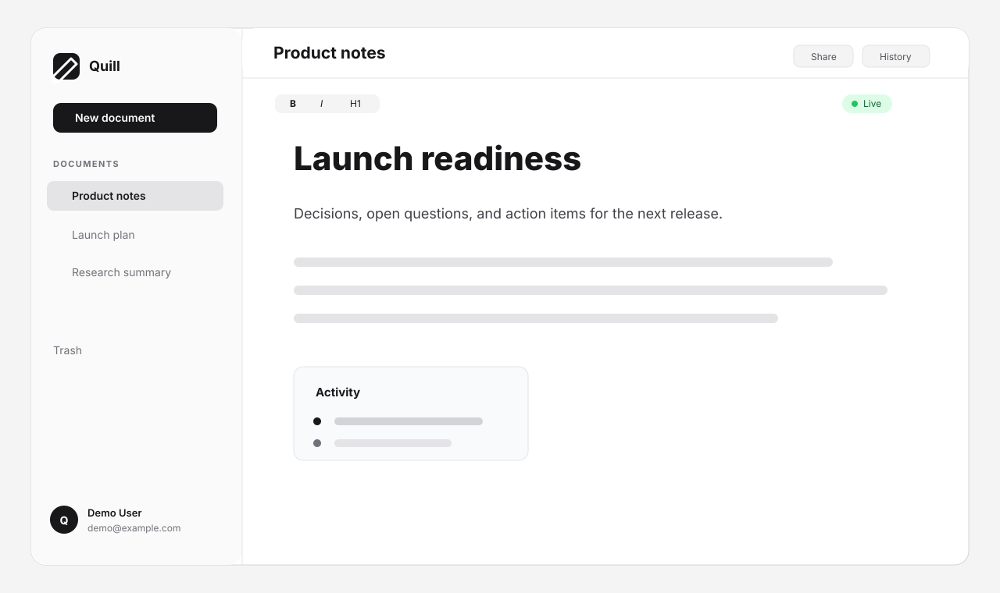

# Quill Collab

Quill Collab is a Notion-inspired collaborative editor built with Next.js, NestJS, PostgreSQL, Prisma, TipTap, and Yjs. It supports account-based documents, real-time multi-user editing, share links, version restore, trash/restore flows, and a per-document activity feed.



## Tech Stack

| Layer | Choice | Why |
| --- | --- | --- |
| Web | Next.js 16, React 19, Tailwind CSS | App Router, good local DX, fast production build |
| Editor | TipTap + ProseMirror | Rich editor primitives without writing an editor engine |
| Sync | Yjs CRDT protocol over WebSocket | Conflict-free merge, offline-capable data model, compact binary updates |
| API | NestJS 10 | Modular backend with DI, guards, DTO validation, and WebSocket support |
| Data | PostgreSQL + Prisma 7 | Durable source of truth, migrations, typed access |
| Auth | JWT access token + HTTP-only refresh cookie | Simple SPA auth with refresh rotation hooks |
| Ops | Docker Compose | One command for Postgres, API, web, migrations, and health checks |

## Quickstart With Docker

Requirements:

- Docker Desktop or Docker Engine with Compose v2

Run the whole stack:

```bash
docker compose up --build
```

Open:

- Web: http://localhost:3000
- API health: http://localhost:4000/healthz
- Postgres: localhost:5432

The API container runs Prisma migrations automatically before starting:

```bash
prisma migrate deploy && node dist/main
```

Useful commands:

```bash
docker compose ps
docker compose logs -f api
docker compose down
docker compose down -v
```

The compose file uses `DOCKER_POSTGRES_*` variables so an existing local `.env` for development does not accidentally make containers connect to `localhost`. To customize ports or secrets, copy `.env.example` to `.env` and edit the Docker section.

## Local Development

Requirements:

- Node.js 20+
- pnpm 10+
- Docker, for local Postgres

Install dependencies:

```bash
pnpm install
```

Create local env:

```bash
cp .env.example .env
```

Start only Postgres:

```bash
pnpm db:up
```

Apply migrations and generate Prisma Client:

```bash
pnpm --filter @quill-collab/api prisma:migrate
pnpm --filter @quill-collab/api prisma:generate
```

Run both apps:

```bash
pnpm dev
```

Local URLs:

- Web: http://localhost:3000
- API: http://localhost:4000
- WebSocket endpoint: ws://localhost:4000

## Architecture Overview

The source layout follows the plan in [PROJECT.md](PROJECT.md):

```text
apps/
  api/          NestJS API, Prisma schema, auth, documents, sharing, versions, activity, WS sync
  web/          Next.js app, TipTap editor, document UI, share-link UI
packages/
  shared/       Shared DTO/event TypeScript types
```

High-level flow:

1. The web client authenticates with the API and stores the short-lived access token in memory.
2. The editor opens a Yjs document and connects to the NestJS WebSocket gateway.
3. The gateway authenticates either a JWT user or a public share token.
4. Yjs updates are broadcast to other clients in the same document room.
5. After a short idle window, the merged Yjs state is persisted to `Document.yState`.
6. Idle persistence also feeds version snapshots and throttled activity events.
7. Share links use token validation and can be read-only or writable.

The API is intentionally service-oriented: controllers validate and route, services own Prisma queries, and WebSocket payloads are typed through `packages/shared` where they cross app boundaries.

## CRDT Decision And Tradeoffs

The central architecture choice is using a CRDT, specifically Yjs, instead of operational transform or server-side JSON diffing.

Why Yjs:

- Concurrent edits converge without a central conflict-resolution algorithm.
- The server can broadcast binary updates and persist merged state without understanding every editor operation.
- Offline support becomes a natural extension of the data model rather than a separate reconciliation project.
- TipTap has first-class Yjs integration, so the editor and sync model fit together.
- Yjs updates are compact enough for real-time document editing.

Tradeoffs accepted:

- The client bundle is larger than a plain REST editor.
- The persisted `yState` is an opaque binary blob, so direct SQL inspection of document content is not pleasant.
- Server-side search and content analytics require deriving text from Yjs state or maintaining a secondary index.
- The WebSocket process currently owns in-memory rooms, so horizontal scaling would need Redis pub/sub or another fanout layer.
- Debugging CRDT bugs requires understanding Yjs update semantics, not only application-level JSON.

Rejected alternative: storing document blocks as JSONB and sending REST diffs. That looks simpler at first, but it pushes conflict handling into application code. For collaborative editing, especially with reconnects and simultaneous edits, that creates a larger correctness burden than accepting Yjs as the sync primitive.

## API Hardening

The API includes:

- Structured exception responses with `requestId`.
- Request ID middleware and Pino request correlation.
- Helmet and CORS restricted to the configured web origin.
- Rate limiting on auth endpoints.
- `/healthz` with a database ping.
- Docker health checks for Postgres, API, and web.

## Docker Notes

`api.Dockerfile` is multi-stage:

1. install workspace dependencies
2. generate Prisma Client
3. build NestJS
4. run as a non-root user

`web.Dockerfile` is multi-stage:

1. install workspace dependencies
2. build Next.js with standalone output
3. copy only the standalone server, static assets, and public assets
4. run as a non-root user

`NEXT_PUBLIC_API_URL` and `NEXT_PUBLIC_WS_URL` are build arguments for the web image because they are bundled into browser code by Next.js.

## Testing

Useful checks:

```bash
pnpm --filter @quill-collab/api lint
pnpm --filter @quill-collab/api build
pnpm --filter @quill-collab/api exec jest --runInBand --watchman=false
pnpm --filter @quill-collab/api exec jest --config ./test/jest-e2e.json --runInBand --watchman=false
pnpm --filter @quill-collab/web lint
pnpm --filter @quill-collab/shared exec tsc --noEmit
```

Note: web type-checking currently depends on the local `@hookform/resolvers` and Zod 4 type compatibility. If it fails in `login/page.tsx` or `register/page.tsx`, that is the resolver/schema typing issue documented during hardening, not a Docker change.

## AI Tool Usage

AI tools used:

- Codex was used as a pair-programming agent for scaffolding NestJS modules, Prisma schema changes, Dockerfiles, Compose wiring, and README drafting.
- The project plan in `PROJECT.md` was used as the source of truth for phase boundaries and architectural intent.

Where AI helped:

- It was strongest at repetitive implementation work: DTO wiring, module imports, Prisma migration shape, React loading states, and Docker/Compose boilerplate.
- It helped keep cross-cutting work consistent, such as using the same `healthz` endpoint in the API and Docker health check.

Where AI fell short:

- Yjs protocol details needed careful review. The update/sync path is subtle, and generated suggestions can be plausible but wrong if they mix up Yjs sync step semantics.
- AI tends to suggest more infrastructure than the timebox needs. Redis fanout, queues, Swagger, background workers, and richer permission models were consciously deferred.

Where human judgment overrode AI:

- The document source of truth stayed as Yjs binary state in Postgres rather than a hand-merged JSON document tree.
- The WebSocket implementation stayed single-instance for the demo instead of adding Redis prematurely.
- The README documents the CRDT tradeoff directly because that decision matters more than adding another feature.

## What I Would Do Next

Consciously deferred work:

- Redis pub/sub for multi-instance WebSocket fanout.
- Document folders and nested organization.
- Embedded blocks such as images, tables, and mentions.
- Full-text search with a derived Postgres `tsvector` index.
- Email verification and password reset.
- Rich permissions beyond owner plus share tokens.
- Mobile-optimized editor and navigation.
- Playwright end-to-end coverage for browser workflows.
- A short Loom walkthrough. The README is ready for a link once that recording exists.

## License

Private demo project.
